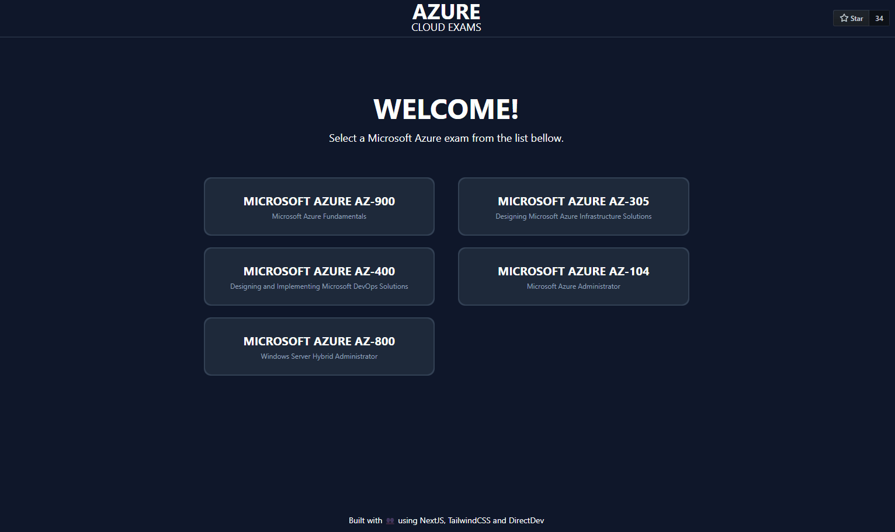

<h1 align="center">Azure Cloud Exams</h1>
<br />

<div align="center">
This is a web application built with Next.js, TypeScript, CosmosDB, GraphQL and TailwindCSS. The application is a quiz
that tests your knowledge of Azure fundamentals, specifically for the AZ-900 certification exam. The questions are
stored in a Cosmos DB database and retrieved using GraphQL queries. The application is deployed on Microsoft Azure.

This project was created for learning purposes to help me understand Microsoft Azure and CosmosDB in preparation for
the AZ-900 exam.

UPDATE: The project is now using this
[repo](https://github.com/Ditectrev/Microsoft-Azure-AZ-900-Microsoft-Azure-Fundamentals-Exam-Questions-Answers) as a
database, replacing Cosmos DB.

UPDATE2: The project has a new name to better fit it's purpose, now it has all azure exams from this [collection](https://github.com/Ditectrev?q=azure&type=all&language=&sort=)

</div>

<br />


<div align="center">
<br />


</div>

## 🌟 Features

- Question sets scrapped from this
  [repo](https://github.com/Ditectrev?q=azure&type=all&language=&sort=).
- Correct answer displayed for each question.
- Practice mode & Exam mode.

## 🌱 Getting Started

Clone the repository:

```bash
git clone https://github.com/eduardconstantin/azure-cloud-exams.git
```

Install dependencies:

```bash
npm install
```

Enable Git hooks:

```bash
npm run prepare
```

Run the app:

```bash
npm run dev
```

Open your browser and navigate to [http://localhost:3000](http://localhost:3000).
